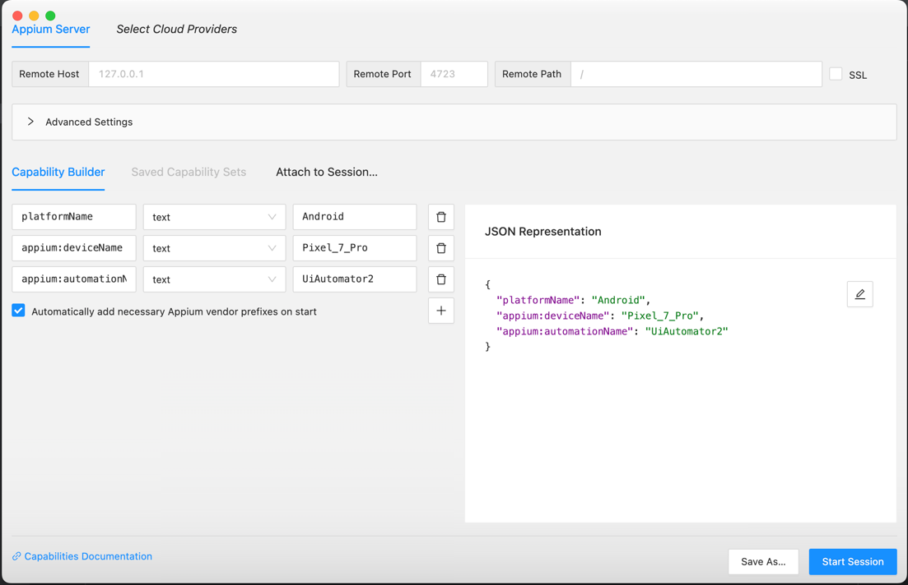
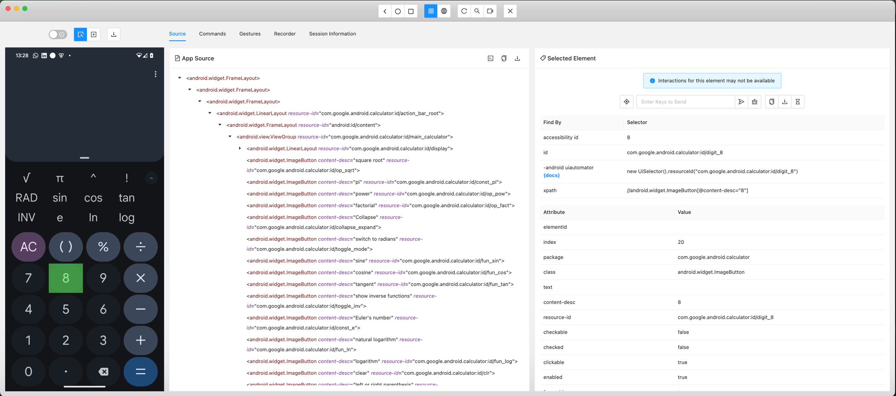

Steps to start Appium-python automation
1) Install node.js since appium is a web server written in Node.JS: 'brew install node'
2) Install Appium: 'npm install -g appium'
3) Install a web driver: 'npm install wd'
4) Install android studio, it comes with an sdk - https://developer.android.com/studio/install.html
5) Add ANDROID_HOME to PATH
6) Install Appium python client https://pypi.org/project/Appium-Python-Client/
7) Install Selenium: https://pypi.org/project/selenium/
8) Connect a mobile device to your computer
9) Turn on developer options on the android device.
10) Open this project in PyCharm
11) Select CalculatorAndroidTests and hit the Run button

Tips:

Open two terminals:
1) Start appium in the first tab
2) Use the second window for adb commands or python

To find all devices attached to your computer:
`adb devices -l`

To find a package name for your Android application; in this case Calculator:
`adb shell 'pm list packages' | grep 'calculator'`

Reply:
`package:com.google.android.calculator`

To find an active application:
`adb shell dumpsys window windows | grep -E 'mCurrentFocus|mFocusedApp'`

Reply:
  `mCurrentFocus=Window{7f49c61 u0 com.google.android.calculator/com.android.calculator2.Calculator}`
  `mFocusedApp=AppWindowToken{7a594f1 token=Token{8e91e7b ActivityRecord{86e0675 u0 com.google.android.calculator/com.android.calculator2.Calculator t851}}}`

To find identifiers for elements in your application, open your application on your device and start Appium Inspector session

